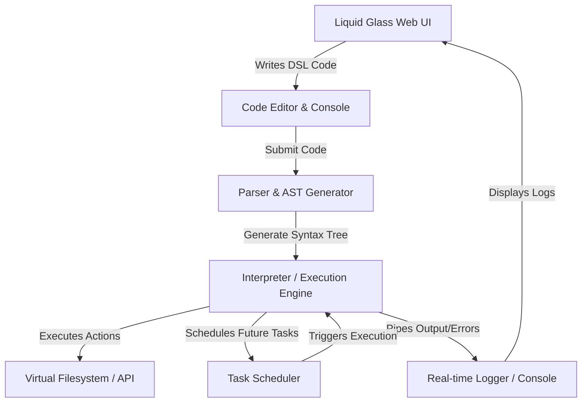

# DSL Task Automator

A lightweight, visually stunning web-based IDE and client-side runtime environment for a custom **Domain-Specific Language (DSL) for Task Automation**. The application is designed to help both technical and non-technical users automate common computer-based operations (like file manipulation, scheduler checks, API polling, and system logging) in a unified, interactive workspace.

Designed and developed by **Nweke Chigozie Emmanuel** as part of a Bachelor of Science (B.Sc.) Seminar project in Computer Science at Chukwuemeka Odumegwu Ojukwu University.

---

## 🌟 Core Features

- **Liquid Glass Web UI**: A high-end dark mode interface leveraging **Glassmorphism** styling (frosted glass panels, dynamic WebGL noise shaders, and Three.js interactive visualizers).
- **Custom DSL Compiler & Interpreter**: A custom Lexer/Parser implementation that runs scripts in a sandboxed, client-side virtual environment.
- **Built-in Task Scheduler**: Register intervals directly from code using simple statements like `every X seconds do { ... }` to execute workflows in the background.
- **Virtual Workspace Filesystem**: Create, append, read, and delete mock/virtual files stored and tracked in your local workspace session.
- **Real-Time Logs & Console**: Interactive log viewer with filtered categories (info, success, warning, error) capturing step-by-step executions.
- **Template Presets**: Ready-to-use template scripts showcasing file cleanup routines, API monitoring, and scheduled alerts.

---

## 🎨 Design System: Liquid Glass

The application adheres to the **Liquid Glass** aesthetic, combining translucent physical properties with moving ambient light gradients.

- **Background Canvas**: Deep dark theme (`#0b0f19` to `#1e1b4b`) integrated with custom WebGL noise/glow shaders or interactive Three.js node visualizers.
- **Frosted Panels**: Translucent panels with blur backdrops, reflective subtle borders (`rgba(255, 255, 255, 0.08)`), and deep soft drop shadows.
- **Vibrant Accents**: High-saturation liquid glow spots in Neon Cyan (`#00f2fe`) and Electric Purple (`#4facfe`).
- **Typography**: Inter / custom sans-serif system fonts mapping a clean, readable layout.

---

## ⚙️ Architecture & Components



- **Front-End (`src/app/page.tsx`)**: Integrates the workspace editor, scheduler, logs console, file list, and visual customizers into a single dashboard.
- **Interpreter Core (`src/lib/interpreter.ts`)**: Implements the `DSLInterpreter` which parses scripts line-by-line, matching statements with Regular Expressions to simulate operation promises.
- **Visualizers (`src/components/`)**:
  - `BackgroundShader.tsx`: WebGL shader generating organic, shifting multi-colored light noise.
  - `ThreeVisualizer.tsx`: Three.js custom particle/point animation simulating floating fluid data.

---

## 📜 DSL Syntax Specification

The interpreter scans statements and runs them sequentially. Lines starting with `#` or `//` are treated as comments.

### Supported Statements

| Command Pattern | Description |
| :--- | :--- |
| `create file "name" with content "content"` | Creates a new virtual file with the specified string content. |
| `append file "name" with content "content"` | Appends content to an existing virtual file. |
| `read file "name"` | Logs the current content of the virtual file. |
| `delete file "name"` | Deletes a virtual file from the workspace. |
| `log "message"` | Logs a custom string message into the terminal. |
| `sleep/wait X seconds` | Temporarily halts script execution for `X` seconds. |
| `http get "url"` | Executes an asynchronous HTTP GET request and prints the response status and content snippet. |
| `every X seconds do { ... }` | Registers a recurring task to execute the block within the scheduler. |

### Example Scripts

#### 1. API Health Check & File Generation
```dsl
log "Starting health check automation..."
http get "https://jsonplaceholder.typicode.com/todos/1"
create file "server_status.json" with content "{\"status\":\"active\",\"checkedAt\":\"now\"}"
log "Health check complete. Log saved to server_status.json"
```

#### 2. Scheduled Background Task
```dsl
every 10 seconds do {
  log "Performing automated ping test..."
  http get "https://jsonplaceholder.typicode.com/posts/1"
}
```

---

## 🚀 Getting Started

### Prerequisites
- [Node.js](https://nodejs.org/) (v18.0.0 or higher recommended)
- `npm` (or `yarn` / `pnpm` / `bun`)

### Installation & Run

1. Clone or navigate to the workspace directory.
2. Install the project dependencies:
   ```bash
   npm install
   ```
3. Start the local development server:
   ```bash
   npm run dev
   ```
4. Open [http://localhost:3000](http://localhost:3000) in your web browser.

---

## 🧪 Verification & Testing Strategy

The parsing and execution engine can be verified under standard test conditions as outlined in the Technical Design Document (`TDD.md`):

1. **Lexer & Parser Verification**: Verify that variables and command formats are matched properly, reporting correct syntax errors for invalid input.
2. **Virtual Filesystem State**: Assert updates to files and storage upon `create`, `append`, and `delete` directives.
3. **Task Scheduling Intervals**: Verify that scheduler intervals fire asynchronously at the precise intervals requested.
