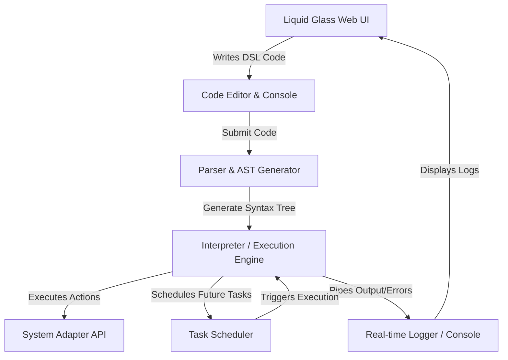

# TECHNICAL DESIGN DOCUMENT (TDD)
## DOMAIN-SPECIFIC LANGUAGE (DSL) FOR TASK AUTOMATION WITH LIQUID GLASS DESIGN

---

## 1. PROJECT BRIEF

### 1.1 Overview
The goal of this project is to develop a lightweight, user-friendly, and visually stunning web-based IDE and runtime environment for a **Domain-Specific Language (DSL) for Task Automation**. The application enables both technical and non-technical users to automate repetitive tasks—such as file operations, job scheduling, report generation, and system monitoring—without the steep learning curve of general-purpose scripting languages like Python or Bash.

### 1.2 Core Objectives
- **Simplification**: Replace complex programming syntax with structured, readable, and intuitive commands.
- **Unified Interface**: Provide a web-based editor, execution engine, real-time log monitor, and task scheduler in a single workspace.
- **Aesthetic Excellence**: Implement a state-of-the-art **Liquid Glass (Glassmorphism)** design system that offers a premium, immersive, and highly responsive user experience.

---

## 2. DESIGN SYSTEM: LIQUID GLASS

The user interface will be built using a **Liquid Glass** aesthetic. This design paradigm focuses on soft, translucent layers, fluid background gradients, thin reflective borders, and vibrant glow highlights to simulate physical glass interacting with dynamic liquid light.

### 2.1 Visual Tokens
- **Background**: Deep, dark ambient canvases with organic, slowly shifting radial or linear gradients (`#0b0f19` to `#1e1b4b`).
- **Glass Panel (Frosted)**:
  - Background: `rgba(255, 255, 255, 0.03)` to `rgba(255, 255, 255, 0.07)`
  - Backdrop Filter: `blur(16px) saturate(180%)`
  - Border: `1px solid rgba(255, 255, 255, 0.08)`
  - Box Shadow: `0 8px 32px 0 rgba(0, 0, 0, 0.37)`
- **Liquid Accents**: Glowing highlights using high-saturation neon/cyan (`#00f2fe`), electric purple (`#4facfe`), and emerald green (`#05ffc5`) with blur radii of 50px–150px in the background.
- **Typography**: Sleek, high-legibility sans-serif typefaces (e.g., *Inter*, *Outfit*, or *Cabinet Grotesk*) with contrasting weights.

### 2.2 UI Component Mockup Prompts
Below are prompts to be used with AI image generators or design assistants to iterate on the visuals:

> **Prompt 1 (Main IDE Dashboard):**
> *A premium web app dashboard UI for a code editor, liquid glassmorphism design style. The interface has a frosted glass sidebar, a central editor panel with dark glowing syntax-highlighted code, and a right panel showing scheduled tasks. Soft organic fluid liquid gradients in the background with neon blue, deep violet, and magenta glowing spots shining through the translucent panels. Sleek, minimal UI controls, glowing borders, modern sans-serif typography, highly polished, dark mode.*

> **Prompt 2 (Task Scheduler Module):**
> *A glassmorphic scheduled-task card UI, liquid glass style, glossy translucent surface, neon cyan glowing active states, thin reflective light border, realistic refractive glass drop shadows. Background has soft fluid purple gradients. Clean icons, futuristic minimalist design.*

---

## 3. ARCHITECTURE BREAKDOWN

The application uses a modular, client-side runtime with the following core architectural components:



### 3.1 Components Detailed

#### 3.1.1 Front-End Layer (Liquid Glass Web UI)
- **Code Editor**: A syntax-highlighted code area configured for the custom DSL.
- **Control Panel**: Play, pause, stop, and schedule controls styled with glassy, glowing interactive feedback.
- **Log Monitor**: A live-scrolling terminal window displaying interpreter output, warnings, and performance metrics.
- **Scheduler Overview**: A visual list of active automation cron-jobs or intervals.

#### 3.1.2 Compilation Layer (Parser & Interpreter)
- **Lexer/Parser**: Scans the input string, tokenizes commands, and constructs an Abstract Syntax Tree (AST).
- **Execution Engine (Interpreter)**: Traverses the AST and translates nodes into executable JavaScript promises or operations (e.g., simulating file writes, reading mock data, or calling APIs).

#### 3.1.3 Task Scheduler Module
- Manages deferred or repeating operations.
- Translates DSL syntax like `every 5 minutes do ...` into active interval handlers or simulated chron jobs.

---

## 4. DSL SYNTAX SPECIFICATION (SAMPLE)

The parser will process commands matching patterns such as:

```dsl
# File creation task
create file "monthly_report.txt" with content "Generated Report Data"

# Scheduling task
every 10 seconds do {
    log "Performing health check..."
    read file "server_status.json"
}
```

---

## 5. VERIFICATION & TESTING STRATEGY (TDD APPROACH)

To verify the parser, compiler, and interpreter modules:

### 5.1 Lexer & Parser Tests
- **Test Case 1**: Tokenize valid command syntax and assert AST correctness.
- **Test Case 2**: Reject malformed commands with clear syntax error locations.

### 5.2 Interpreter Tests
- **Test Case 3**: Assert action outcomes (e.g., verify virtual filesystem state after `create file` commands).
- **Test Case 4**: Assert scheduling intervals fire at exactly the expected times.
